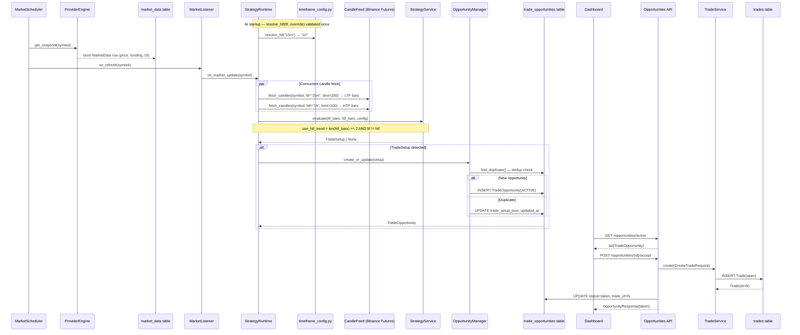

# Architecture

## System Overview

KiyoDesk is a **Strategy Intelligence Platform**. Its central design principle is that
all trading intelligence flows through the **Domain Engine**. No other layer — Dashboard,
Journal, or AI — ever analyzes raw market data directly.

```
Provider Engine
  ├── BinanceProvider    — price + funding + OI (Futures public API, no key required)  ← default first
  ├── CoinGeckoProvider  — price only (no key required)                                ← fallback
  ├── CCXTProvider       ✅ v0.5  — price + funding + OI (exchange-configurable, no key needed)
  └── KiyotakaProvider   — price + funding + OI + liquidations (API key required)
      ↓
Market Scheduler              — snapshot collection only, no business logic
      ↓
Trading Runtime               ✅ v0.5.2  — resolves TFs, fetches real OHLCV candles, orchestrates lifecycle
  ├── timeframe_config.py     — VALID_TIMEFRAMES, DEFAULT_HTF_MAP, resolve_htf()
  └── CandleFeed              — Binance Futures /fapi/v1/klines (public, no API key)
      ↓
Domain Engine
  ├── Strategy Engine         ✅ v0.5  — ICT Pure OTE, produces TradeSetup (live signals on BTC/ETH)
  ├── Confidence Engine       🔲 v0.6  — multi-factor signal confidence scoring
  ├── Market Regime Engine    🔲 v0.7  — trend/range/expansion classification
  ├── Replay Engine           🔲 v0.9  — historical scenario replay
  └── Analytics Extensions            — performance aggregation on Domain outputs
      ↓
Trade Opportunity             ✅ v0.5  — persisted setup awaiting user decision
      ↓
Trade Journal                 ✅       — records accepted opportunities as trades
      ↓
Dashboard                     ✅       — renders opportunities, market, analytics
      ↓
AI Assistant                  🔲 v1.0  — explains Domain Engine outputs
```

---

## Complete Sequence Diagram



---

## Layer Responsibilities

### Provider Engine

Fetches and caches raw market snapshots from external sources. Enforces rate limiting.
Provides snapshot data to the Market Scheduler only.

**Providers (failover order configurable via `MARKET_PROVIDERS`):**

| Provider | Data | Key required | Default order |
|---|---|---|---|
| `binance` | price, funding rate, OI | ❌ | 1st |
| `coingecko` | price only | ❌ | 2nd (fallback) |
| `ccxt_{exchange}` | price, funding, OI — exchange-configurable | ❌ (public endpoints) | optional |
| `kiyotaka` | price, funding, OI, liquidations | ✅ | optional |

**CCXTProvider notes:**
- `liquidation_volume` is always `None` — CCXT 4.4.30 does not implement `fetchLiquidations`.
  Kiyotaka is the only source of liquidation data.
- OI is computed as `openInterestAmount × price` (CCXT returns base-currency amount).
- Exchange is configurable: `CCXT_EXCHANGE=binance|bybit|bitget|okx`
- Exchange instances are created per-request to avoid CCXT async event-loop issues.

### Candle Feed (`app/providers/candles.py`)

Fetches real OHLCV candlestick bars from the **Binance Futures public API**
(`/fapi/v1/klines`). No API key required. Called directly by the Trading Runtime
on every scheduler tick — separate from the snapshot Provider Engine.

```
fetch_candles(symbol, interval, limit) → list[Bar]
  symbol: "BTC" | "ETH"  →  mapped to "BTCUSDT" | "ETHUSDT"
  interval: any VALID_TIMEFRAME string (e.g. "15m", "1h", "4h")
  limit: strategy_candle_limit (LTF) | strategy_htf_candle_limit (HTF)
```

### Market Scheduler

Collects market snapshots on a 60-second interval. Calls the `on_refresh` callback after
each successful symbol refresh. **Contains no business logic.**

### Trading Runtime ✅ v0.5.2

The orchestration layer. The **only** component allowed to connect
Candle Feed → Strategy Engine → Trade Opportunities → Trade Journal.

Modules:
- `strategy_runtime.py` — resolves TFs at construction, fetches OHLCV concurrently, runs strategy, persists opportunity
- `timeframe_config.py` — `VALID_TIMEFRAMES`, `DEFAULT_HTF_MAP`, `resolve_htf()`, `InvalidTimeframeError`
- `market_listener.py` — callback adapter; swallows runtime errors
- `opportunity_manager.py` — create-or-update with deduplication
- `lifecycle_manager.py` — all status transitions
- `deduplicator.py` — prevents duplicate ACTIVE opportunities

On every scheduler tick the Runtime:
1. Resolves `htf = resolve_htf(ltf, override)` — done once at startup, not per tick
2. Fetches LTF bars (`strategy_candle_limit`, default 200) and HTF bars (`strategy_htf_candle_limit`, default 100) **concurrently** from Binance Futures
3. Runs `StrategyService.evaluate()` with `use_htf_trend = True` when `ltf != htf` and bars are available
4. If a `TradeSetup` is detected, persists or updates the `TradeOpportunity`

### Domain Engine

The single source of truth for trading intelligence. Composed of:

- **Strategy Engine** ✅ — detects ICT Pure OTE setups: swing pivots, BOS, HTF EMA
  trend filter, Fibonacci OTE zone, entry/stop/target derivation. Returns `TradeSetup`.
  Fires live signals on BTC and ETH every 60 seconds.
- **Confidence Engine** 🔲 — scores `TradeSetup` objects against confluence factors.
  Field `confidence` on `TradeOpportunity` is null until v0.6.
- **Market Regime Engine** 🔲 — classifies market state (trending, ranging, expanding).
  Field `market_regime` on `TradeOpportunity` is null until v0.7.
- **Replay Engine** 🔲 *(v0.9)* — replays historical data through the full stack.
- **Analytics Extensions** — aggregates performance metrics on Domain Engine outputs.

### Trade Opportunity ✅ v0.5

A persisted record representing a detected setup awaiting user decision.
Status machine: `ACTIVE → TAKEN | REJECTED | INVALIDATED | EXPIRED`, `TAKEN → COMPLETED`.

### Trade Journal

Records trades created from accepted opportunities. Each trade links back to its
originating `TradeOpportunity` via `trade_id`.

### Dashboard ✅

Renders the full application: Signal Center, Live Market, Active Opportunities, Analytics,
Trade Journal. All API calls use relative `/api/v1` URLs, proxied server-side by Vite —
works correctly from any external browser, not just Replit's preview pane.

### AI Assistant *(v1.0 — frozen until v0.7 is complete)*

Explains Domain Engine outputs in natural language. Input: structured Domain Engine data.
Never receives raw price, funding, or liquidation data.

---

## Strategy Engine — Module Map (v0.5)

```
app/domain/strategy/
  interfaces/bar.py           Bar dataclass — OHLCV + timestamp (frozen, Decimal)
  models/config.py            StrategyConfig — all 13 kScript inputs as Pydantic fields
  models/trade_setup.py       TradeSetup — domain object output
  ict/swing.py                Swing pivot detection
  ict/bos.py                  Break of Structure
  ict/htf_trend.py            HTF EMA + slope filter
  ict/ote.py                  OTE zone state machine
  ict/risk.py                 SL/TP/RR calculation
  ict/engine.py               StrategyEngine — stateful orchestrator
  services/strategy_service.py  Public boundary — bar-by-bar replay
```

### Strategy Engine Data Flow

```
list[Bar] LTF (e.g. 15m, 200 bars)  +  list[Bar] HTF (e.g. 1h, 100 bars)  +  StrategyConfig
        ↓
StrategyEngine.evaluate()  [bar-by-bar replay via StrategyService]
        ↓
  swing.detect_pivots()  →  bos.detect_bos()  →  htf_trend.evaluate_trend()
        ↓
  ote.update_zone()  →  ote.check_tap()  →  risk.calculate_*_risk()
        ↓
  TradeSetup | None
```

---

## Trading Runtime — Module Map (v0.5.2)

```
app/runtime/
  strategy_runtime.py     Resolves TFs at init → fetches OHLCV → runs strategy → persists
  timeframe_config.py     VALID_TIMEFRAMES, DEFAULT_HTF_MAP, InvalidTimeframeError, resolve_htf()
  market_listener.py      Callback adapter (scheduler → runtime)
  opportunity_manager.py  create_or_update with deduplication
  lifecycle_manager.py    Status transitions + InvalidTransitionError
  deduplicator.py         find_existing() — checks ACTIVE duplicates by entry ± tolerance

app/providers/candles.py  Binance Futures kline fetcher — fetch_candles(symbol, interval, limit)

app/models/trade_opportunity.py   SQLAlchemy model
app/repositories/opportunity_repository.py  Persistence layer
app/schemas/opportunity.py        API request/response schemas
app/api/v1/opportunities.py       5 REST endpoints
```

### Multi-Timeframe Configuration

`timeframe_config.py` defines the full MTF system:

```python
VALID_TIMEFRAMES = ('1m','3m','5m','15m','30m','1h','2h','4h','6h','12h','1d','1w','1M')

DEFAULT_HTF_MAP = {
    '1m': '5m',  '3m': '15m', '5m': '15m',
    '15m': '1h', '30m': '4h',
    '1h': '4h',  '2h': '12h', '4h': '12h',
    '6h': '1d',  '12h': '1d',
    '1d': '1w',  '1w': '1M',  '1M': '1M',
}

resolve_htf(ltf, override=None)
  # override non-empty → return override (validated)
  # override empty/None → return DEFAULT_HTF_MAP[ltf]
  # invalid ltf or override → raise InvalidTimeframeError(ValueError)
```

`StrategyRuntime` validates both at `__init__` time — misconfiguration surfaces at startup,
never silently on the first scheduler tick.

---

## CCXTProvider — Module Map (v0.5)

```
app/providers/ccxt/
  __init__.py              Package stub
  exchange_factory.py      create_exchange(settings) / close_exchange(exchange)
                           — per-request factory, OKX swap override, 4 supported exchanges
  normalizer.py            Pure functions: ticker_to_price, funding_rate_to_decimal,
                           open_interest_to_usd, build_snapshot → MarketSnapshot
  provider.py              CCXTProvider — implements MarketDataProvider
                           name = "ccxt_{exchange_id}"
                           Concurrent fetch: ticker (required) + funding + OI (best-effort)
```

**Configuration:**
```
CCXT_EXCHANGE=binance          # binance | bybit | bitget | okx
CCXT_MARKET_TYPE=future        # future | swap | spot
CCXT_API_KEY=                  # optional for private endpoints
CCXT_API_SECRET=               # optional
CCXT_SYMBOL_MAP=BTC:BTC/USDT:USDT,ETH:ETH/USDT:USDT
MARKET_PROVIDERS=binance,coingecko   # default; prepend ccxt_binance if preferred
```

**Known limitation:** `liquidation_volume` is always `None` from CCXTProvider.
CCXT 4.4.30 does not implement `fetchLiquidations` for Binance, Bybit, or Bitget futures.

---

## Database

KiyoDesk uses **PostgreSQL** on Replit (auto-configured via the `DATABASE_URL`
environment variable). The async SQLAlchemy engine uses `asyncpg`; Alembic migrations
use `psycopg2-binary` for synchronous access.

`sslmode=disable` is mapped to `connect_args={"ssl": False}` for asyncpg compatibility.

Schema is managed via Alembic in `backend/alembic/versions/`.

---

## REST API Surface

```
# Market
GET  /api/v1/market/{symbol}              current snapshot (price, funding, OI)
GET  /api/v1/market/{symbol}/history      time-series history

# Opportunities
GET  /api/v1/opportunities                list all (filter: symbol, status, limit)
GET  /api/v1/opportunities/active         list ACTIVE opportunities
GET  /api/v1/opportunities/{id}           get one
POST /api/v1/opportunities/{id}/accept    accept → create trade journal entry
POST /api/v1/opportunities/{id}/reject    reject → lifecycle only

# Trades (Journal)
GET    /api/v1/trades                     list trades (filter: symbol)
POST   /api/v1/trades                     create trade
PATCH  /api/v1/trades/{id}/close          close trade with exit price
DELETE /api/v1/trades/{id}               delete trade

# Analytics
GET  /api/v1/analytics                    aggregated metrics (filter: symbol)

# System
GET  /api/v1/system/status                provider health and scheduler status
```

---

## TradeSetup — the Domain Object

`TradeSetup` is the common currency of the Domain Engine. Every downstream
layer consumes `TradeSetup` or structures derived from it — never raw market data.

```
TradeSetup (ephemeral)
  ↓ Trading Runtime
TradeOpportunity (persisted, carries trade_setup_json)
  ├── Dashboard → renders visually
  ├── Accept → Trade Journal entry
  ├── Confidence Engine (v0.6) → scores it
  └── AI Assistant (v1.0) → explains it
```

---

## AI Policy

The AI Assistant is an **explanation layer**, not an intelligence layer.

Permitted AI inputs:
- `TradeSetup` objects from the Strategy Engine
- `ConfidenceScore` objects from the Confidence Engine (v0.6)
- Market Regime classifications from the Market Regime Engine (v0.7)
- `TradeOpportunity` records (structured Domain Engine output)
- Trade Journal entries with Domain Engine context

Prohibited AI inputs:
- Raw price series
- Raw funding rate, open interest, or liquidation data
- Any data that has not passed through the Domain Engine

---

## Development Constraints

- No AI work until v0.5 (Strategy Engine), v0.6 (Confidence Engine), and v0.7
  (Market Regime Engine) are complete and tested.
- The Scheduler collects snapshots only — it must never evaluate strategies or create trades.
- The Trading Runtime is the only component allowed to connect the Candle Feed to the Domain Engine.
- The Strategy Engine (`app/domain/strategy/ict/`) is frozen — do not modify without a confirmed defect.
- The kScript is the canonical reference. Python behavior must match kScript behavior exactly.
- External code imports from `services/` only — never directly from `ict/`.
- The Domain Engine must be independently testable without the API, Dashboard, or AI layers.
- All frontend API calls must use relative URLs (`/api/v1/...`) — never `http://localhost:8000`.
- Timeframes must be validated at construction time via `resolve_htf()` — startup must fail loudly on bad config.
- HTF candles must always be fetched from the provider — never resampled from LTF data.

---

## Further Reading

- `docs/strategy/STRATEGY.md` — Strategy Engine usage and architecture
- `docs/strategy/ICT.md` — ICT Pure OTE parameter reference and rule documentation
- `docs/strategy/TRADE_SETUP.md` — TradeSetup field reference and consumer guide
- `docs/runtime/RUNTIME.md` — Trading Runtime module map, MTF config, and data flow
- `docs/runtime/OPPORTUNITIES.md` — TradeOpportunity field reference and API guide
- `docs/runtime/LIFECYCLE.md` — Status machine, transitions, and LifecycleManager usage
