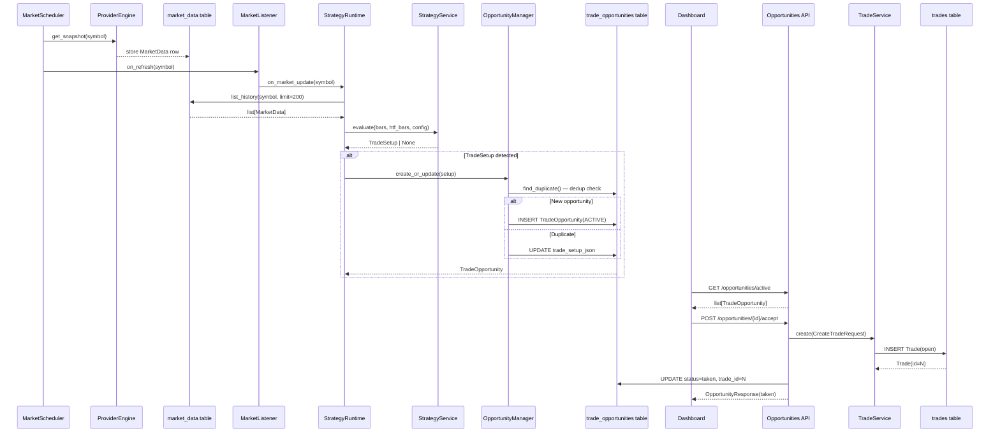

# Architecture

## System Overview

KiyoDesk is a **Strategy Intelligence Platform**. Its central design principle is that
all trading intelligence flows through the **Domain Engine**. No other layer — Dashboard,
Journal, or AI — ever analyzes raw market data directly.

```
Provider Engine
  ├── KiyotakaProvider   — price + funding + OI + liquidations (API key required)
  ├── CCXTProvider       ✅ v0.5  — price + funding + OI (exchange-configurable, no key needed)
  ├── BinanceProvider    — price + funding + OI (no liquidations, no key required)
  └── CoinGeckoProvider  — price only (no key required)
      ↓
Market Scheduler              — data collection only, no business logic
      ↓
Trading Runtime               ✅ v0.5  — orchestrates the complete trading lifecycle
      ↓
Domain Engine
  ├── Strategy Engine         ✅ v0.5  — ICT Pure OTE, produces TradeSetup
  ├── Confidence Engine       🔲 v0.6  — multi-factor signal confidence scoring
  ├── Market Regime Engine    🔲 v0.7  — trend/range/expansion classification
  ├── Replay Engine           🔲 v0.9  — historical scenario replay
  └── Analytics Extensions            — performance aggregation on Domain outputs
      ↓
Trade Opportunity             ✅ v0.5  — persisted setup awaiting user decision
      ↓
Trade Journal                 ✅       — records accepted opportunities as trades
      ↓
Dashboard                     ✅       — renders opportunities, market, analytics
      ↓
AI Assistant                  🔲 v1.0  — explains Domain Engine outputs
```

---

## Complete Sequence Diagram (Sprint 2.5)



---

## Layer Responsibilities

### Provider Engine
Fetches and caches raw market data from external sources (Kiyotaka, Binance, CoinGecko).
Enforces rate limiting. Provides data to the Domain Engine only via the Market Scheduler.

**Providers (failover order configurable via `MARKET_PROVIDERS`):**

| Provider | Data | Key required |
|---|---|---|
| `kiyotaka` | price, funding, OI, liquidations | ✅ |
| `ccxt_{exchange}` ✅ | price, funding, OI — exchange-configurable (binance/bybit/bitget/okx) | ❌ (public endpoints) |
| `binance` | price, funding, OI | ❌ |
| `coingecko` | price only | ❌ |

**CCXTProvider notes:**
- `liquidation_volume` is always `None` — CCXT 4.4.30 does not implement `fetchLiquidations` for supported exchanges. Kiyotaka remains the only source of liquidation data.
- OI is computed as `openInterestAmount × price` (CCXT returns base-currency amount; USD value requires multiplication).
- Exchange is configurable: `CCXT_EXCHANGE=binance|bybit|bitget|okx`
- Exchange instances are created per-request to avoid CCXT async event-loop issues.

### Market Scheduler
Collects market data on a 60-second interval. Calls the `on_refresh` callback after
each successful symbol refresh. **Contains no business logic.**

### Trading Runtime ✅ v0.5
The orchestration layer connecting all Domain Engine components. The **only** component
allowed to connect Market Data → Strategy Engine → Trade Opportunities → Trade Journal.

Modules:
- `strategy_runtime.py` — loads bars, runs strategy, persists opportunity
- `market_listener.py` — callback adapter; swallows runtime errors
- `opportunity_manager.py` — create-or-update with deduplication
- `lifecycle_manager.py` — all status transitions
- `deduplicator.py` — prevents duplicate ACTIVE opportunities

### Domain Engine
The single source of truth for trading intelligence. Composed of:

- **Strategy Engine** ✅ — detects ICT Pure OTE setups: swing pivots, BOS, HTF EMA
  trend filter, Fibonacci OTE zone, entry/stop/target derivation. Returns `TradeSetup`.
- **Confidence Engine** 🔲 — scores `TradeSetup` objects against confluence factors.
  Field `confidence` on `TradeOpportunity` is null until v0.6.
- **Market Regime Engine** 🔲 — classifies market state (trending, ranging, expanding).
  Field `market_regime` on `TradeOpportunity` is null until v0.7.
- **Replay Engine** 🔲 *(v0.9)* — replays historical data through the full stack.
- **Analytics Extensions** — aggregates performance metrics on Domain Engine outputs.

### Trade Opportunity ✅ v0.5
A persisted record representing a detected setup awaiting user decision.
Status machine: `ACTIVE → TAKEN | REJECTED | INVALIDATED | EXPIRED`, `TAKEN → COMPLETED`.

### Trade Journal
Records trades created from accepted opportunities. Each trade links back to its
originating `TradeOpportunity` via `trade_id`.

### Dashboard ✅
Renders the full application: Live Market, Active Opportunities, Analytics, Trade Journal.

### AI Assistant *(v1.0 — frozen until v0.7 is complete)*
Explains Domain Engine outputs in natural language. Input: structured Domain Engine data.
Never receives raw price, funding, or liquidation data.

---

## Strategy Engine — Module Map (v0.5)

```
app/domain/strategy/
  interfaces/bar.py           Bar dataclass — OHLCV + timestamp (frozen, Decimal)
  models/config.py            StrategyConfig — all 13 kScript inputs as Pydantic fields
  models/trade_setup.py       TradeSetup — domain object output
  ict/swing.py                Swing pivot detection
  ict/bos.py                  Break of Structure
  ict/htf_trend.py            HTF EMA + slope filter
  ict/ote.py                  OTE zone state machine
  ict/risk.py                 SL/TP/RR calculation
  ict/engine.py               StrategyEngine — stateful orchestrator
  services/strategy_service.py  Public boundary — bar-by-bar replay
```

### Strategy Engine Data Flow

```
list[Bar] (LTF)  +  list[Bar] (HTF)  +  StrategyConfig
        ↓
StrategyEngine.evaluate()
        ↓
  swing.detect_pivots()  →  bos.detect_bos()  →  htf_trend.evaluate_trend()
        ↓
  ote.update_zone()  →  ote.check_tap()  →  risk.calculate_*_risk()
        ↓
  TradeSetup | None
```

---

## Trading Runtime — Module Map (v0.5)

```
app/runtime/
  strategy_runtime.py     Loads bars → runs strategy → persists opportunity
  market_listener.py      Callback adapter (scheduler → runtime)
  opportunity_manager.py  create_or_update with deduplication
  lifecycle_manager.py    Status transitions + InvalidTransitionError
  deduplicator.py         find_existing() — checks ACTIVE duplicates by entry ± tolerance

app/models/trade_opportunity.py   SQLAlchemy model
app/repositories/opportunity_repository.py  Persistence layer
app/schemas/opportunity.py        API request/response schemas
app/api/v1/opportunities.py       5 REST endpoints
```

---

## CCXTProvider — Module Map (v0.5)

```
app/providers/ccxt/
  __init__.py              Package stub
  exchange_factory.py      create_exchange(settings) / close_exchange(exchange)
                           — per-request factory, OKX swap override, 4 supported exchanges
  normalizer.py            Pure functions: ticker_to_price, funding_rate_to_decimal,
                           open_interest_to_usd, build_snapshot → MarketSnapshot
  provider.py              CCXTProvider — implements MarketDataProvider
                           name = "ccxt_{exchange_id}"
                           Concurrent fetch: ticker (required) + funding + OI (best-effort)
```

**Configuration:**
```
CCXT_EXCHANGE=binance          # binance | bybit | bitget | okx
CCXT_MARKET_TYPE=future        # future | swap | spot
CCXT_API_KEY=                  # optional for private endpoints
CCXT_API_SECRET=               # optional
CCXT_SYMBOL_MAP=BTC:BTC/USDT:USDT,ETH:ETH/USDT:USDT
MARKET_PROVIDERS=kiyotaka,ccxt_binance,binance,coingecko
```

**Known limitation:** `liquidation_volume` is always `None` from CCXTProvider.
CCXT 4.4.30 does not implement `fetchLiquidations` for Binance, Bybit, or Bitget futures.
Kiyotaka is the only provider that supplies liquidation data. If Kiyotaka's free tier
rate limit is exceeded, liquidations will show as `—` on the dashboard until the next
successful Kiyotaka request.

---

## REST API Surface (Sprint 2.5 additions)

```
GET  /api/v1/opportunities              list all (filter: symbol, status, limit)
GET  /api/v1/opportunities/active       list ACTIVE opportunities
GET  /api/v1/opportunities/{id}         get one
POST /api/v1/opportunities/{id}/accept  accept → create trade journal entry
POST /api/v1/opportunities/{id}/reject  reject → lifecycle only
```

---

## TradeSetup — the Domain Object

`TradeSetup` is the common currency of the Domain Engine. Every downstream
layer consumes `TradeSetup` or structures derived from it — never raw market data.

```
TradeSetup (ephemeral)
  ↓ Trading Runtime
TradeOpportunity (persisted, carries trade_setup_json)
  ├── Dashboard → renders visually
  ├── Accept → Trade Journal entry
  ├── Confidence Engine (v0.6) → scores it
  └── AI Assistant (v1.0) → explains it
```

---

## AI Policy

The AI Assistant is an **explanation layer**, not an intelligence layer.

Permitted AI inputs:
- `TradeSetup` objects from the Strategy Engine
- `ConfidenceScore` objects from the Confidence Engine (v0.6)
- Market Regime classifications from the Market Regime Engine (v0.7)
- `TradeOpportunity` records (structured Domain Engine output)
- Trade Journal entries with Domain Engine context

Prohibited AI inputs:
- Raw price series
- Raw funding rate, open interest, or liquidation data
- Any data that has not passed through the Domain Engine

---

## Development Constraints

- No AI work until v0.5 (Strategy Engine), v0.6 (Confidence Engine), and v0.7
  (Market Regime Engine) are complete and tested.
- The Scheduler collects data only — it must never evaluate strategies or create trades.
- The Trading Runtime is the only component allowed to connect market data to the Domain Engine.
- The Strategy Engine (Sprint 2) is frozen — do not modify without a confirmed defect.
- The kScript is the canonical reference. Python behavior must match kScript behavior exactly.
- External code imports from `services/` only — never directly from `ict/`.
- The Domain Engine must be independently testable without the API, Dashboard, or AI layers.

---

## Further Reading

- `docs/strategy/STRATEGY.md` — Strategy Engine usage and architecture
- `docs/strategy/ICT.md` — ICT Pure OTE parameter reference and rule documentation
- `docs/strategy/TRADE_SETUP.md` — TradeSetup field reference and consumer guide
- `docs/runtime/RUNTIME.md` — Trading Runtime module map and data flow
- `docs/runtime/OPPORTUNITIES.md` — TradeOpportunity field reference and API guide
- `docs/runtime/LIFECYCLE.md` — Status machine, transitions, and LifecycleManager usage
